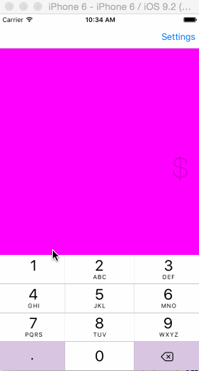

# TipCalculator

This is a Tip Calculator application for iOS submitted as the [pre-assignment](https://gist.github.com/timothy1ee/7747214) requirement for CodePath.

Time spent: 8 hours

Completed:

* [x] Required: User can enter a bill amount, choose a tip percentage, and see the tip and total values.
* [x] Required: Settings page to change the default tip percentage.
* [x] Optional: UI animations
* [x] Optional: Remembering the bill amount across app restarts (if <10mins)
* [ ] Optional: Using locale-specific currency and currency thousands separators.
* [x] Optional: Making sure the keyboard is always visible and the bill amount is always the first responder. This way the user doesn't have to tap anywhere to use this app. Just launch the app and start typing.

# Installation

- Download [Xcode from the Mac App Store](https://itunes.apple.com/us/app/xcode/id497799835?ls=1&mt=12), requires OS X 10.9.4+.

- Clone this repo
`$ git clone https://github.com/gwongz/tip-calculator.git`

- Open the `tipCalculator.xcodeproj` project in XCode. 

- To launch the app in the simulator, go to Project -> Run or hit Command-R. 

Note: This app does not use auto layout and is designed for an iPhone 6. 

GIF created with [LiceCap](https://github.com/lepht/licecap).